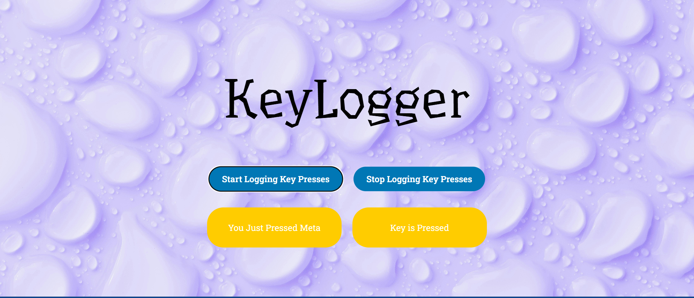

# 🔑 KeyLogger Web App

A simple and interactive web-based KeyLogger built using **HTML**, **CSS**, and **JavaScript**. This app lets you monitor keyboard events in real-time, displaying the key pressed and its current state (pressed/released). Built with a beautiful UI and a clean layout.

## 🚀 Features

- 🎯 Tracks keyboard key presses and releases
- 🟢 Start and Stop buttons to control logging
- 📋 Real-time display of key name and status
- 🎨 Clean, aesthetic UI with background image

- 🧠 Beginner-friendly JavaScript event handling

## 📸 Demo

 <!-- Replace this with an actual screenshot if needed -->

## 🛠️ Tech Stack

- **HTML5** – Structure of the webpage
- **CSS3** – Styling and responsive layout
- **JavaScript** – Event handling and interactivity

## 📂 Project Structure

